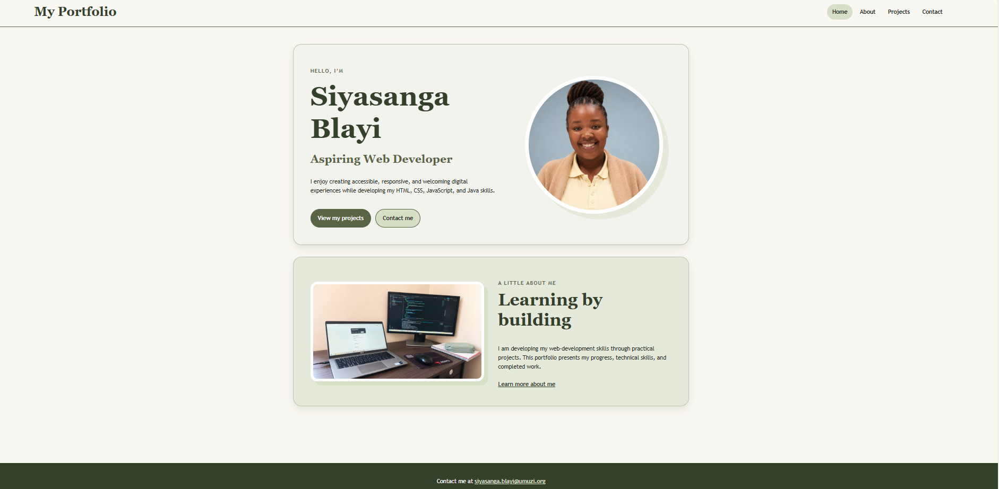
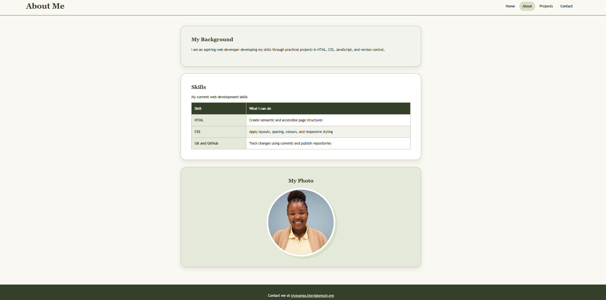
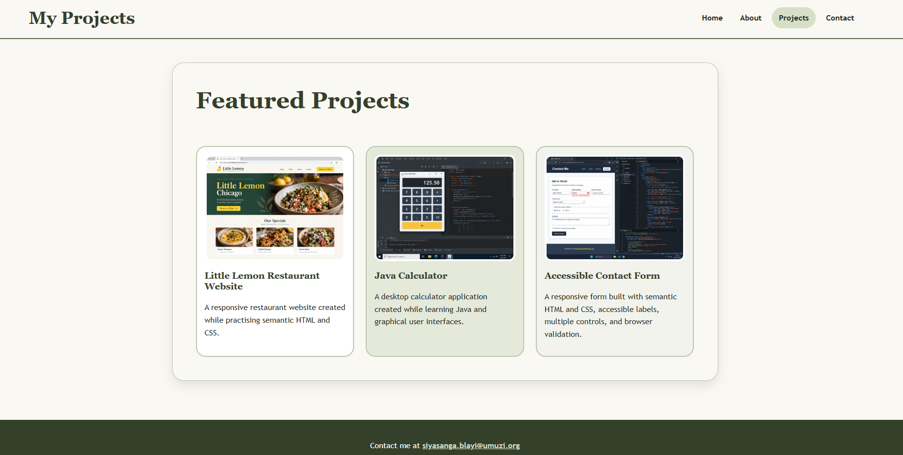
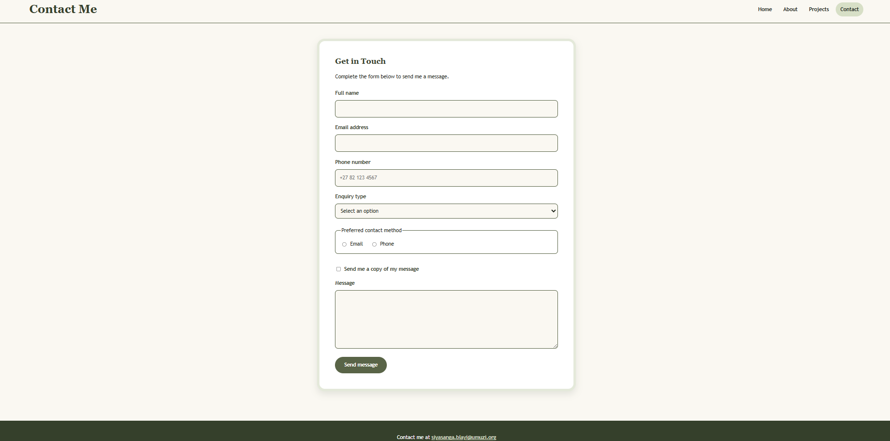
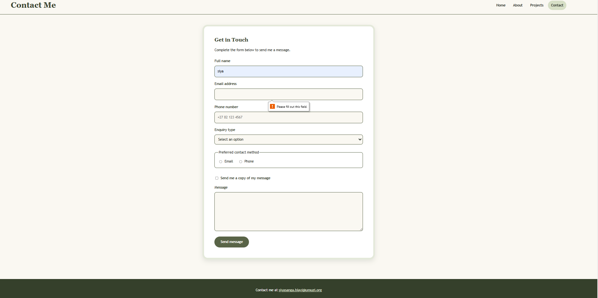
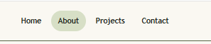
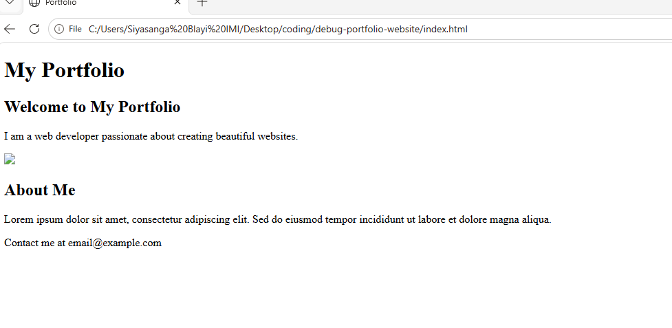

# Siyasanga Blayi Portfolio

## Overview

This is a responsive four-page portfolio website created using HTML and CSS. Its purpose is to introduce me as an aspiring web developer, display my skills and projects, and provide an accessible contact form.

The website contains the following pages:

- Home
- About
- Projects
- Contact

## Issues Found

The starter website contained several errors and missing features:

- Missing semantic HTML elements
- Missing navigation links
- Missing images and alternative text
- Incomplete project information
- Missing table content
- Form controls without labels
- Missing form validation
- Incomplete CSS styling
- Poor spacing and alignment
- No responsive layout

A more detailed list is available in design/issues-identified.txt.

## Fixes Implemented

I added descriptive page titles, character encoding, viewport metadata, and semantic elements such as header, nav, main, section, article, and footer.

I created consistent navigation on all four pages and added five images with descriptive alternative text. The About page now contains a structured skills table with three rows and two columns.

The Contact page includes:

- Full-name input
- Email input
- Telephone input
- Select menu
- Radio buttons
- Checkbox
- Message area
- Submit button
- Labels and validation attributes

The stylesheet uses element, class, ID, descendant, attribute, and pseudo-class selectors. I used Flexbox, Grid, responsive images, and two media queries to support desktop, tablet, and mobile screens.

The final olive colour palette provides good contrast and consistent styling. All four HTML pages and the CSS pass W3C validation.

## How to View

1. Clone or download this repository.
2. Open the project folder.
3. Open index.html in a web browser.
4. Use the navigation menu to visit the other pages.

No installation or external dependencies are required.

## Screenshots

### Homepage

### About Page and Skills Table

### Projects Page

### Contact Page

### Form Validation

### Navigation Hover State

### Homepage Before Improvements

## Reflection

The most challenging parts were correcting the semantic structure, creating an accessible form, and making the layout work at different screen sizes.

I solved these problems by checking each requirement individually, testing the navigation and form, resizing the browser, and using the W3C validators. This project helped me understand how HTML provides structure while CSS controls presentation and responsive layout.